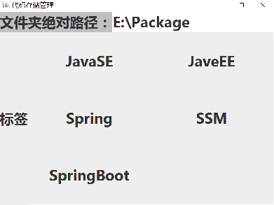

## FileManager 文件管理器

> **注意**： 程序由Java语言编写，请预先安装好Java运行环境。

功能比较简单，拥有图形化界面，目前有以下功能：
- **自定义**分类和标签
- **复制**源目录到当前目录，统一管理
- 将源目录进行**压缩**，并统一备份

## 使用说明

点击Main.jar或者点击Main.bat都可以运行程序。

需要将文件夹绝对路径输入进去，才能点击按钮进入标签选择（防止误操作）

## 自定义

category.txt 文件存储的是分类信息，tag.txt存储的是分类与标签的对应信息

